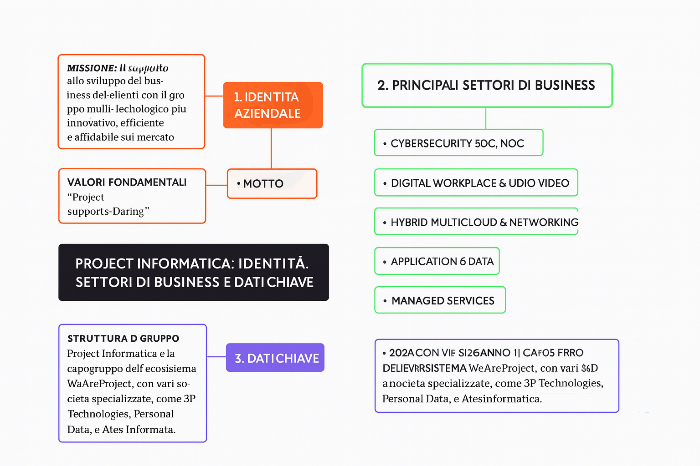

# 🧠 DocuMind App

DocuMind è una piattaforma full-stack per **archiviazione e classificazione intelligente dei documenti** con AI locale (Ollama), composta da tre servizi principali:

- **Frontend**: Next.js 16 + React 19 (`frontend-documind`)
- **Backend API**: Spring Boot 4 + MariaDB (`springboot-documind`)
- **AI Engine**: Flask + Ollama (`backandpy-documind`)

L’obiettivo è gestire il ciclo completo: autenticazione utente, caricamento documento, analisi semantica multi-tag, conferma umana dei casi incerti e consultazione archivio.

---

## 📌 Executive Summary

Il repository implementa una pipeline ibrida:

1. l’utente carica un file dal frontend;
2. Spring Boot inoltra il file al servizio Python;
3. Python estrae testo, chiama Ollama e produce tag con confidence score;
4. Spring Boot applica soglie decisionali:
   - `>= 0.75`: classificazione automatica;
   - `0.45 - 0.74`: conferma utente richiesta;
   - `< 0.45`: bassa confidenza.
5. il frontend mostra risultato, popup di conferma (se necessario) e organizzazione in cartelle suggerite.

---

## 🏗️ Architettura del sistema

### Componenti

### 1) Frontend (`frontend-documind`)
- Interfaccia utente (login, signup, dashboard, tag management)
- Stato locale con Redux Toolkit
- API Routes Next.js come BFF/proxy verso Spring Boot
- UI con `styled-components`

### 2) Spring Boot Backend (`springboot-documind`)
- API REST principali (`/api/v1/...`)
- Gestione utenti e sessioni tramite token in DB + cookie HttpOnly
- Gestione metadati file (non storage binario)
- Orchestrazione con backend Python per classificazione AI

### 3) Python AI Backend (`backandpy-documind`)
- Parsing testo da `.txt`, `.pdf`, `.docx`, `.md`, `.csv`, `.html`
- Prompt engineering verso Ollama
- Risposta multi-label con confidence score, summary e dati estratti
- Fallback a regole keyword se output AI non coerente

### Flusso runtime (end-to-end)

```text
Browser (Next.js UI)
   -> Next.js API routes (/api/auth/*, /api/classify/*)
   -> Spring Boot (/api/v1/*)
   -> Flask AI (/api/classify)
   -> Ollama (/api/generate)
   -> ritorno risultato + regole soglia + UI feedback
```

---

## ✨ Funzionalità implementate

### Classificazione documenti
- Upload e analisi file con tag multipli
- Confidence score per tag
- Esito a stati: `CLASSIFIED`, `PARTIAL_CONFIRMATION`, `CONFIRMATION_REQUIRED`, `LOW_CONFIDENCE`
- Conferma manuale dei tag incerti
- Cartella suggerita automaticamente in base ai tag

### Gestione archivio
- Lista file dell’utente autenticato
- Filtri API su categoria, subtype, semantic type, tag e intervallo date
- Update parziale metadati file
- Cancellazione file metadata

### Utenti e sessione
- Registrazione utente
- Login con email o telefono
- Cookie `authentication-token` HttpOnly
- Logout, estensione sessione, update profilo, update password, delete account
- Seed automatico utente demo in profilo `dev`

### Esperienza frontend
- Dashboard con ricerca, filtri e ordinamento
- Onboarding e privacy consent in `localStorage`
- Gestione tag custom lato UI (attualmente in-memory/frontend state)
- Sezione stato backend (`/api/backend/status`)

---

## 🧰 Stack tecnico

### Backend Java
- Java 21
- Spring Boot 4.0.2
- Spring Data JPA
- Spring Security
- MariaDB JDBC Driver
- MapStruct
- Maven Wrapper (`./mvnw`)

### Backend Python
- Python 3.11
- Flask
- flask-cors
- requests
- python-dotenv
- PyPDF2
- python-docx
- Ollama (servizio esterno)

### Frontend
- Next.js 16.2.1
- React 19.2.4
- TypeScript
- Redux Toolkit + React Redux
- styled-components
- ESLint 9

### Infrastruttura
- Docker Compose
- MariaDB 11
- Ollama container

---

## 📁 Struttura repository

```text
documind-app/
├── README.md
├── docker-compose.yml
├── springboot-documind/
│   ├── src/main/java/com/example/documind/
│   │   ├── entities/users
│   │   ├── entities/files
│   │   ├── entities/classifications
│   │   ├── security/tokens
│   │   └── configurations
│   └── src/main/resources/
├── backandpy-documind/
│   ├── app.py
│   ├── requirements.txt
│   └── .env
├── frontend-documind/
│   ├── app/
│   ├── lib/
│   └── package.json
└── images/
```

---

## 🚀 Quick Start (sviluppo locale)

## Prerequisiti
- Java 21+
- Python 3.11+
- Node.js 20+
- pnpm (o npm)
- MariaDB in esecuzione
- Ollama installato localmente

### 1) Avvia Ollama e scarica un modello

```bash
ollama serve
ollama pull qwen2.5:1.5b
```

### 2) Avvia backend Python

```bash
cd /home/runner/work/documind-app/documind-app/backandpy-documind
pip install -r requirements.txt
python app.py
# http://localhost:5001
```

### 3) Avvia backend Spring

```bash
cd /home/runner/work/documind-app/documind-app/springboot-documind
./mvnw spring-boot:run
# http://localhost:8080
```

> Nota importante: `application-dev.properties` punta di default a `app.python.url=http://localhost:5002`, mentre il backend Python parte su `5001`.
> In locale conviene forzare la variabile:
>
> ```bash
> APP_PYTHON_URL=http://localhost:5001 ./mvnw spring-boot:run
> ```

### 4) Avvia frontend

```bash
cd /home/runner/work/documind-app/documind-app/frontend-documind
pnpm install
pnpm dev
# http://localhost:3000
```

### 5) Credenziali demo (profilo dev Spring)
- Email: `test@documind.local`
- Password: `test123`
- Telefono: `+391111111111`

---

## 🐳 Avvio con Docker Compose

Da root repository:

```bash
docker-compose up -d --build
```

Servizi esposti:
- MariaDB: `localhost:3307`
- Spring Boot: `localhost:8080`
- Python AI: `localhost:5001`

Dopo il primo avvio, caricare il modello nel container Ollama:

```bash
docker exec documind_ollama ollama pull qwen2.5:1.5b
```

---

## 🔌 API Reference (Spring Boot)

Base path: `/api/v1`

### User
- `POST /api/v1/user` registrazione
- `POST /api/v1/user/in` login
- `POST /api/v1/user/out` logout
- `POST /api/v1/user/me/extend-session` estende sessione
- `PUT /api/v1/user/me` update telefono/email
- `POST /api/v1/user/me/verify-password` verifica password attuale
- `PUT /api/v1/user/me/password` cambia password
- `DELETE /api/v1/user/me` cancella account

### File metadata
- `POST /api/v1/files` crea metadata file
- `GET /api/v1/files` lista metadata utente
- `GET /api/v1/files/{fileId}` dettaglio file
- `PATCH /api/v1/files/{fileId}` update metadata
- `DELETE /api/v1/files/{fileId}` cancella metadata

Filtri supportati su `GET /api/v1/files`:
- `category`
- `subType`
- `semanticType`
- `tag`
- `uploadedFrom`
- `uploadedTo`

### Classificazione
- `POST /api/v1/classify/analyze` upload + analisi AI
- `POST /api/v1/classify/confirm` conferma classificazione incerta

### Token maintenance
- `DELETE /api/v1/tokens/user/{userId}` cancella token utente (richiede Authorization header)

---

## 🤖 API Reference (Python AI)

- `POST /api/classify` endpoint principale multi-label
- `POST /api/analyze` endpoint legacy compatibile
- `GET /api/tags/default` elenco tag di sistema
- `GET /api/health` stato servizio e modello Ollama

Output classificazione include:
- `tags` (nome + confidence + categoria)
- `primary_tags`
- `summary`
- `extracted_data`
- `metadata`

---

## 🗃️ Modello dati (Spring)

### `users`
Contiene anagrafica utente, credenziali, ruolo e metadati account.

### `token`
Token di sessione persistiti a DB con `created_at` e `expires_at`.

### `files`
Metadati documento: nome, path, hash, categoria/subtype tecnici, semantic type, score AI, tag, owner, timestamp.

Vincoli rilevanti:
- `hash` univoco globale
- ownership file legata all’email utente
- update email utente con migrazione ownership file

---

## 🔐 Sicurezza (stato attuale)

Implementato:
- Cookie sessione `authentication-token` con `HttpOnly` e `SameSite=Lax`
- Validazione token lato backend per operazioni utente/file
- Validazione payload file con `FileValidator`
- Gestione errori centralizzata con `GlobalExceptionHandler`

Da considerare per hardening produzione:
- password utente attualmente confrontate/salvate senza hashing applicativo esplicito
- in `dev` la security è aperta (`permitAll`)
- cookie `secure=false` (adeguare in HTTPS reale)
- cache analisi pendenti in-memory (`ConcurrentHashMap`) e non persistente

---

## 🧪 Test e qualità

Test presenti nel modulo Spring:

- `DocumindApplicationTests`
- `FileValidatorTest`

Comando:

```bash
cd /home/runner/work/documind-app/documind-app/springboot-documind
./mvnw test
```

Frontend:

```bash
cd /home/runner/work/documind-app/documind-app/frontend-documind
pnpm lint
pnpm build
```

---

## 🖼️ Screenshots




---

## ⚠️ Limiti noti

- Il modulo tag management frontend è locale (non ancora persistito via API dedicata)
- La classificazione pending su Spring è volatile (si perde al riavvio)
- Esiste disallineamento porta Python (`5001` vs `5002` in dev properties)
- Il repository contiene cartelle `.temporary` non parte del runtime principale

---

## 📈 Roadmap tecnica suggerita

- Persistenza server-side dei tag custom (`/api/v1/tags`)
- Persistenza documenti binari (non solo metadata)
- Hardening autenticazione (password hashing + policy)
- Storage distribuito per pending analysis (Redis/DB)
- Copertura test end-to-end tra frontend, Spring e Python

---

## 🤝 Contribuire

1. Crea un branch feature
2. Mantieni i cambi scoped e testabili
3. Aggiorna README/API docs quando modifichi contratti endpoint
4. Apri Pull Request con descrizione tecnica chiara

